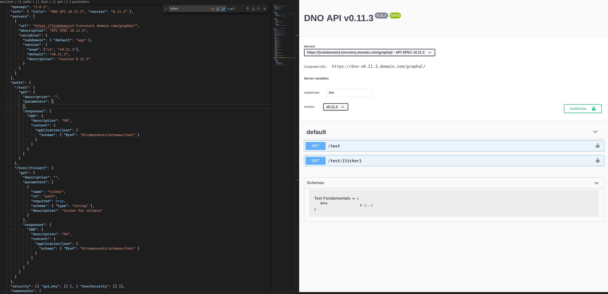

# Api Talk for Dogpatch 26th March 2020


## Building metaphor


## Doors


## Stairs


## Lifts 


## Garden


## Different use case


## What


## catch all


## data service


## interface


## saas


## public vs private


## Why

- what common tasks do you do
- what structure do you need to follow


## How

- repeatable 


## When


## Where


## Who For


Consumers


## Documentation

## Overview


Guides


Auth


Usage


Rate limits


## Anatomy


Communication


Comparison to Restaurant

Comparison to Insurance

999 < death stats >

SLA 
SLO

Insure performance meets x


## Debugging


## Error Handling


## Writing


## Frameworks


## Deployment Targets

- mono repo

- [rush](https://github.com/microsoft/rushstack/)

## Cloud Providers


## Databases


## Regulation 


## DR


## Protocols

- [HateOAS]
- [cowboy_rest]
- [express](https://gist.github.com/mdang/0a8e00883b2e25424e05)

## Monitioring

- [monitoring mean](https://dev.to/moesif/what-does-api-monitoring-mean-for-api-product-managers-and-growth-teams-gfj)

## Version

- [why version](https://cloud.google.com/blog/products/api-management/restful-api-design-tips-versioning)


## Examples

- [Shopify api](https://shopify.dev/docs/storefront-api/reference)

- [github api](https://developer.github.com/v4/explorer/)

## Spec




## Generate demo

```bash

 docker run --rm \
                -v ${PWD}:/local openapitools/openapi-generator-cli generate \
                -i /local/oas.json \
                -g typescript-rxjs \
                -o /local/out/typescript-rxjs

```


## Links


- [api guru](https://apis.guru/awesome-openapi3/category.html)

- [What developers mean when they say "API" - DEV Community 👩‍💻👨‍💻
](https://blog.bearer.sh/what-is-an-api/)

- [7 apis u did not know you needed](https://www.twilio.com/blog/cool-apis)